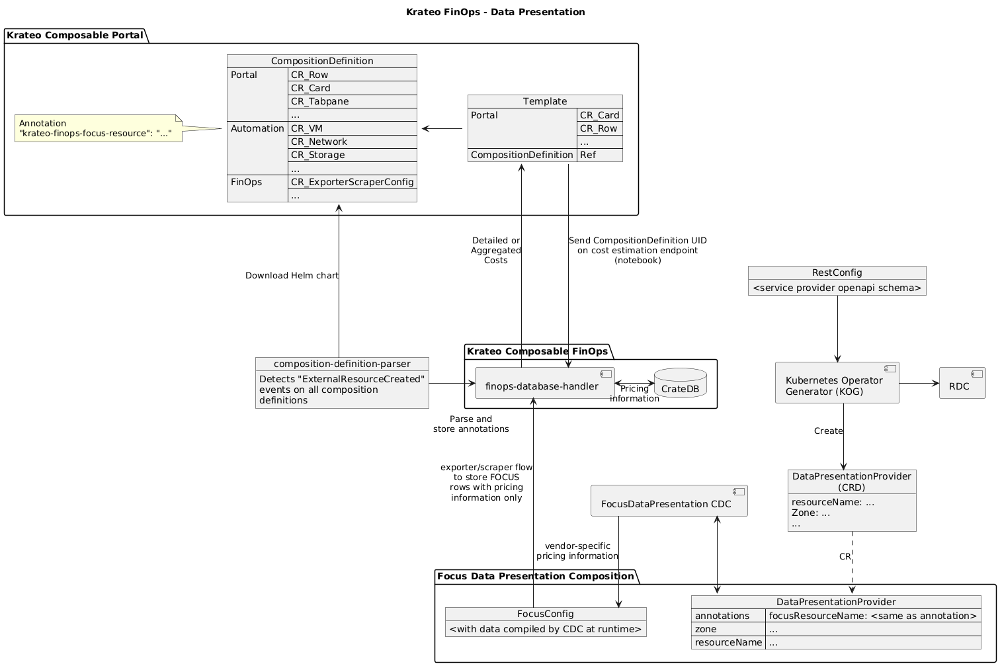
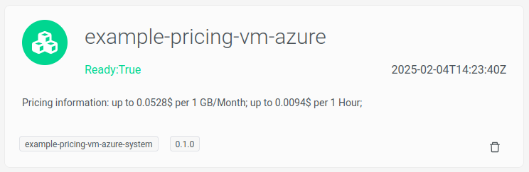

# Krateo FinOps Module Pricing Example

This repository contains a Composition Definition for Krateo that leverages the Krateo Composable FinOps components to integrate resources create through the Azure Operator and the pricing visualization flow. The composition creates a Virtual Machine on Azure through the Azure operator, visualizing it in the frontend through a card widget and custom form. The widget shows the pricing information retrieved through the FinOps module.

It achieves so through the following components:
 - [finops-composition-definition-parser](https://github.com/krateoplatformops/finops-composition-definition-parser): this component parses the annotations contained in this chart, with the name `focus-resource-name`;
 - [azure-pricing-rest-dynamic-controller-plugin](https://github.com/krateoplatformops/azure-pricing-rest-dynamic-controller-plugin): plugin for the operator generator to gather data from the Azure pricing API;
 - [focus-data-presentation-azure](https://github.com/krateoplatformops/focus-data-presentation-azure): this composition definition integrates a custom resource for the generator operator that fetches data from the Azure pricing API and the custom resource for the FOCUS operator, which allows the fetched pricing information to be stored into the database.

## Summary

1. [Overview](#overview)
2. [Architecture](#architecture)
3. [Examples](#examples)
4. [Installation](#Installation)

## Architecture
This composition definition uses the components from the following architecture:



## Examples
The following figure shows an example of the pricing information retrieved from the Azure Pricing API placed inside the widget card:


<sub>Note: the `1 GB/Month` expenditure has been added thorugh the API as an example of multiple values and will not show when installing the composition.</sub>

## Installation
Install the cert-manager for the Azure operator:
```
kubectl apply -f https://github.com/cert-manager/cert-manager/releases/download/v1.16.3/cert-manager.yaml
```

Install the Azure operator:
```
helm repo add aso2 https://raw.githubusercontent.com/Azure/azure-service-operator/main/v2/charts
helm repo update
helm upgrade --install aso2 aso2/azure-service-operator \
    --create-namespace \
    --namespace=azureserviceoperator-system \
    --set crdPattern='resources.azure.com/*;compute.azure.com/*;network.azure.com/*'
```

Create the secret with the credentials for the Azure operator
```
cat <<EOF | kubectl apply -f -
apiVersion: v1
kind: Secret
metadata:
 name: aso-credential
 namespace: azure-pricing-system
stringData:
 AZURE_SUBSCRIPTION_ID: # insert your subscription id
 AZURE_TENANT_ID:       # insert your tenant id
 AZURE_CLIENT_ID:       # insert your client id
 AZURE_CLIENT_SECRET:   # insert your client secret
EOF
```

Install [Krateo's Operator generator](https://github.com/krateoplatformops/oasgen-provider/):
```
helm install krateo-oasgen-provider krateo/oasgen-provider -n krateo-system
```

Install the [azure-pricing-rest-dynamic-controller-plugin](https://github.com/krateoplatformops/azure-pricing-rest-dynamic-controller-plugin):
```
helm install azure-pricing-rest-dynamic-controller-plugin krateo/azure-pricing-rest-dynamic-controller-plugin -n azure-pricing-system
```

Install the [focus-data-presentation-azure](https://github.com/krateoplatformops/focus-data-presentation-azure) composition definition:
```
cat <<EOF | kubectl apply -f -
apiVersion: core.krateo.io/v1alpha1
kind: CompositionDefinition
metadata:
  annotations:
     "krateo.io/connector-verbose": "true"
  name: focus-data-presentation-azure
  namespace: azure-pricing-system
spec:
  chart:
    repo: focus-data-presentation-azure
    url: https://charts.krateo.io
    version: "0.1.0"
EOF
```

Install the composition for the [focus-data-presentation-azure](https://github.com/krateoplatformops/focus-data-presentation-azure), which creates the `DataPresentationAzure` resource, managed by the [rest-dynamic-controller](https://github.com/krateoplatformops/rest-dynamic-controller). Then, the [composition-dynamic-controller](https://github.com/krateoplatformops/composition-dynamic-controller) will install the FocusConfig for the [finops-operator-focus](https://github.com/krateoplatformops/finops-operator-focus), which will start the exporter/scraper flow.
```
cat <<EOF | kubectl apply -f -
apiVersion: composition.krateo.io/v0-1-0
kind: FocusDataPresentationAzure
metadata:
  name: finops-example-azure-vm-pricing
  namespace: azure-pricing-system
spec:
  annotationKey: krateo-finops-focus-resource
  filter: serviceName eq 'Virtual Machines' and armSkuName eq 'Standard_B2ats_v2' and armRegionName eq 'westus3' and type eq 'Consumption'
  operatorFocusNamespace: krateo-system
  scraperConfig:
    tableName: pricing_table
    pollingInterval: "1h"
    scraperDatabaseConfigRef: 
      name: finops-database-handler
      namespace: krateo-system
EOF
```

Install the composition definition for this component:
```
cat <<EOF | kubectl apply -f -
apiVersion: core.krateo.io/v1alpha1
kind: CompositionDefinition
metadata:
  annotations:
     "krateo.io/connector-verbose": "true"
  name: finops-example-pricing-vm-azure
  namespace: azure-pricing-system
spec:
  chart:
    repo: finops-example-pricing-vm-azure
    url: https://charts.krateo.io
    version: "0.1.1"
EOF
```

Finally, install the resources for the frontend: [customform.yaml](https://github.com/krateoplatformops/finops-example-pricing-vm-azure/blob/main/customform.yaml).
```
kubectl apply -f customform.yaml
```
